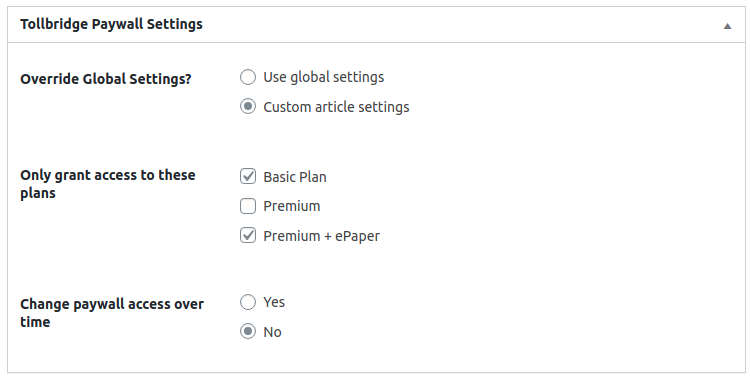

# Tollbridge.co Wordpress Plugin.

## Installation

Download this project as a ZIP file. Within the Wordpress plugins section, upload the plugin, then activate it from the list of plugins.

## Activation
A [Tollbridge.co](https://www.tollbridge.co) account is required. You'll need the App ID, Client ID and Client Secret from the Tollbridge Integrations section.

Once the plugin has been activated, the "Account Settings" panel is available via the "Tollbridge" admin menu. Enter the information from the Tollbridge Integrations section and hit Save. The plugin will attempt to validate your credentials, and will let you know if there's any issue with them.
The "Callback URL" shown on this page needs to be entered into the Tollbridge backend, in the Integrations section.

---

## Paywall Configuration

The general configuration of the paywall takes place inside the Tollbridge backend (layout options, number of articles before paywall is shown, etc). Within Wordpress, you are able to configure which subscription plans should have access to which articles.

The "Change paywall access over time" allows you to be flexible with paywall rules over time. If you wish to have all recent content freely available, but have it moved to a paid archive after 90 days, this would be done by setting the options shown in the screenshot above.

---

Configuration options can be set globally, then overridden on an article-by-article basis. At the bottom of the article editor screen, a set of options matching the global configuration options is available. This allows you to make exceptions for particular articles, e.g. have a fully-paywalled site but make a particular article free to access.

---

## FAQ

### Can I have some articles behind the paywall and some free to access?
Absolutely! There are two ways to achieve this, depending on how many articles you wish to make free:
* set the global paywall rules to restrict access, then on the articles you want free, override the paywall settings on those articles.
* set no global paywall rules (making the full site free to access), then set the paywall restrictions on articles you wish to limit.

### What about time-based access, e.g. "paywalled for a week, then free to access"?
This can be managed in the global settings, selecting the "Change paywall access over time" section, and selecting the number of days after which access should change. This setting can also be set on a per-article level.

### Does this plugin support AMP?
AMP pages are not currently supported by the Tollbridge platform.

---

## License

The MIT License (MIT). Please see [License File](LICENSE.txt) for more information.
